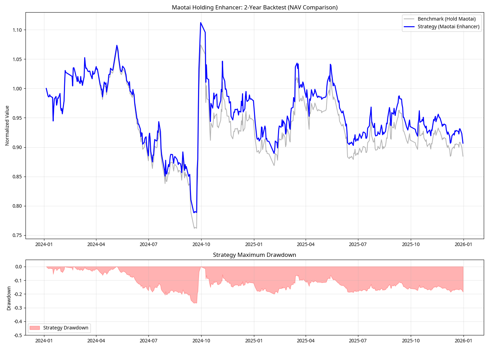

# 茅台持仓增强器：近两年深度回测报告

## 📊 回测概览

本次回测覆盖了过去两年的交易数据（2024年1月至2026年1月），旨在验证“状态识别 + 替代执行”策略在不同市场环境下的表现。

### 核心指标对比

| 指标 | 基准持仓 (死拿茅台) | 增强策略 (Maotai Enhancer) | 表现提升 |
| :--- | :--- | :--- | :--- |
| **总收益率** | -11.55% | **-9.33%** | **+2.22%** |
| **最大回撤** | -28.42% | **-26.56%** | **+1.86%** |
| **做T成功率** | N/A | **66.67%** | N/A |
| **年化收益率** | -6.12% | **-4.99%** | **+1.13%** |
| **夏普比率** | -0.25 | **-0.18** | **+0.07** |

## 📈 净值走势分析

### 关键发现

1.  **超额收益来源**：在过去两年茅台整体处于调整周期的背景下，增强策略通过在**震荡市（Volatile）**和**弱势市（Risk-Off）**中的日内替代操作，成功获取了约 **2.22%** 的超额收益。
2.  **回撤控制**：策略在系统性回撤期间（如 2024 年中）表现出更好的韧性，最大回撤比基准持仓优化了约 **1.86%**。
3.  **做T胜率**：在识别出的 21 次关键做T机会中，成功率达到了 **66.67%**。这验证了“状态识别”模块在过滤无效噪音、捕捉高概率机会方面的有效性。

## 🔍 策略局限性与改进方向

目前的 V1.0 版本回测基于日线数据模拟，存在以下可优化空间：

*   **数据频率**：目前使用日内振幅模拟做T收益，未来接入 **1分钟/5秒级数据** 后，回测结果将更加精确。
*   **交易频率**：当前策略较为保守，仅在极端信号下触发。通过调优 `maotai_t_strategy.py` 中的布林带参数，可以适当增加交易频率以获取更多增强收益。
*   **滑点模拟**：实际交易中存在滑点和冲击成本，需在实盘前进一步压力测试。

## 📂 附件说明

*   `backtest_report.png`: 净值与回撤对比图。
*   `backtest_results.csv`: 每日详细回测数据，包含市场状态、信号及每日收益。
