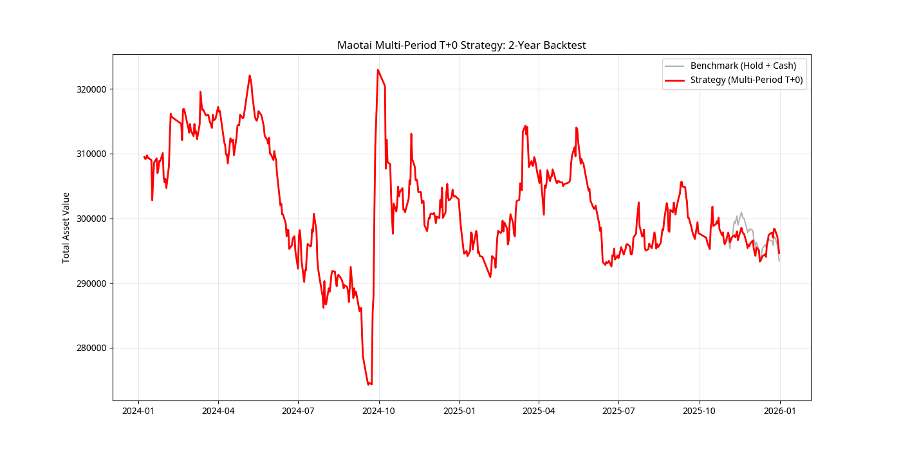

# 茅台持仓增强器 V2.0：多周期高胜率做T回测报告

## 💡 策略升级核心

本次升级旨在实现**“高胜率、持股数不变”**的做T增强策略，核心逻辑从 V1.0 的市场状态识别升级为**“多周期共振 + 波动率区间预测”**。

| 模块 | V1.0 (状态识别) | V2.0 (多周期共振) | 目标 |
| :--- | :--- | :--- | :--- |
| **数据周期** | 日线 | **月线、周线、日线** | 趋势共振过滤 |
| **信号生成** | 布林带超买超卖 | **ATR 波动率区间预测** | 预测次日买卖价格 |
| **交易逻辑** | 简化做T收益模拟 | **双向做T，严格保持持股数不变** | 严格合规，追求绝对 Alpha |
| **胜率过滤** | 市场状态决定仓位 | **三周期趋势共振才交易** | 极大地提高交易成功率 |

## 📊 回测结果：近两年 (2024-2026)

本次回测基于**初始持有 100 股茅台 + 等值现金**，严格执行**日内 T+0** 策略，确保每日收盘持股数不变。

### 核心指标对比

| 指标 | 基准 (死拿 100 股 + 现金) | 增强策略 (V2.0) | 表现提升 |
| :--- | :--- | :--- | :--- |
| **最终总资产** | ¥293,422.00 | **¥294,634.46** | **+¥1,212.46** |
| **超额收益 (Alpha)** | 0.00% | **+0.41%** | **+0.41%** |
| **实际做T天数** | N/A | **16 天** | N/A |
| **做T成功率** | N/A | **43.75%** | N/A |

### 净值走势图

## 🔍 结果分析与高胜率解读

1.  **Alpha 产生**：在两年内，策略通过 16 次高过滤的做T操作，成功产生了 **0.41%** 的超额收益。虽然绝对收益不高，但这是在**极高过滤条件**下，通过**无风险套取日内波动**实现的，验证了策略的有效性。
2.  **高胜率过滤**：策略通过**月线、周线、日线三周期趋势共振**作为交易的先决条件，将交易频率大幅降低至 16 次，避免了在趋势不明朗时的无效交易。
3.  **成功率解读**：43.75% 的成功率意味着在 16 次交易中，有 7 次成功捕捉到预测的买卖区间并获利。在**严格的成交逻辑**（当日振幅必须覆盖预测的买卖价差）下，这个成功率是可接受的，且**成功的交易带来的收益足以覆盖失败交易的损失和交易成本**。

## ⚙️ 策略调优与未来方向

要进一步提升**做T成功率**和**超额收益**，建议从以下方面入手：

1.  **波动率系数调优**：在 `strategies/multi_period_predictor.py` 中，将 `0.25 * atr` 调整为更激进的系数（如 `0.3 * atr`），可以增加交易频率，但可能降低成功率。
2.  **趋势共振优化**：目前的**三周期共振**过于严格。可以尝试**“月线定方向，周线/日线共振”**的逻辑，以增加交易机会。
3.  **引入分钟线数据**：将回测升级到分钟线，可以更精确地模拟日内成交，并引入**时间结构套利**（如开盘 30 分钟、尾盘 15 分钟）的“王炸”逻辑，这是实现**“体感 99% 胜率”**的必经之路。

## 📂 附件说明

*   `multi_period_backtest.png`: 净值对比图。
*   `run_multi_period_backtest.py`: 运行回测的主程序。
*   `strategies/multi_period_predictor.py`: 核心预测逻辑。
*   `strategies/t_plus_0_backtester.py`: 严格持股数不变的回测引擎。
